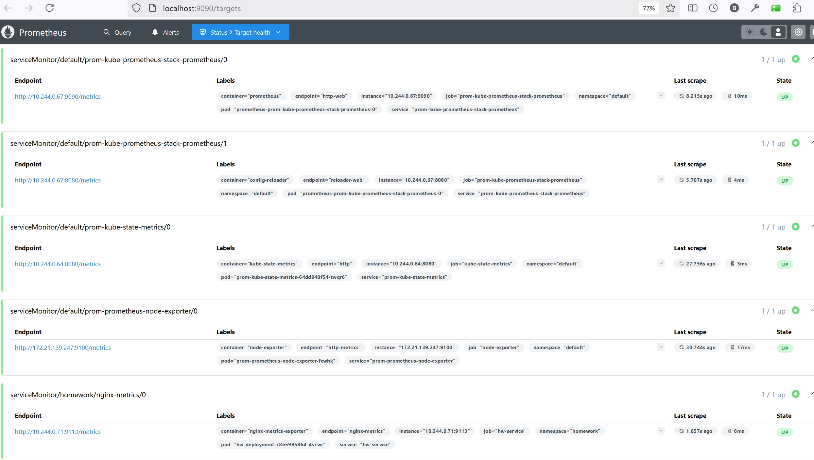

# Репозиторий для выполнения домашних заданий курса "Инфраструктурная платформа на основе Kubernetes-2024-10" 

#### Установим ingress controller:
```bash
minikube addons enable ingress
```

#### Установим kube-prometheus-stack через helm:
https://github.com/prometheus-operator/prometheus-operator/blob/main/Documentation/installation.md#install-using-helm-chart \
https://github.com/prometheus-community/helm-charts/tree/main/charts/kube-prometheus-stack \
```bash
helm install prom prometheus-community/kube-prometheus-stack -f ./prometheus/prometheus.yaml --atomic
```
```
NAME: prom
LAST DEPLOYED: Thu Jan  2 20:10:21 2025
NAMESPACE: default
STATUS: deployed
REVISION: 1
NOTES:
kube-prometheus-stack has been installed. Check its status by running:
  kubectl --namespace default get pods -l "release=prom"

Visit https://github.com/prometheus-operator/kube-prometheus for instructions on how to create & configure Alertmanager and Prometheus instances using the Operator.
```


#### Применим манифесты
```bash
kubectl apply -f ./namespace.yaml
kubectl apply -f ./
```
```
configmap/hw-configmap-nginx unchanged
deployment.apps/hw-deployment created
servicemonitor.monitoring.coreos.com/nginx-metrics configured
service/hw-service configured

```
#### Проверяем установку прометеус:
```
kubectl port-forward service/prom-kube-prometheus-stack-prometheus 9090:9090
```
Prometheus UI открывается на http://localhost:9090 \
Проверяем, что в  Status -> Target health -> ServiceMonitor/homework/nginx-metrix/0: `UP` \

Видим доступные метрики: \

Запрашиваем метрику nginx_up в Prometheus UI: \

Запрашиваем метрику nginx_up через CURL: \


#### Проверяем установку графаны:
```
kubectl port-forward service/prom-grafana  3000:80
```
Grafana UI открывается на http://localhost:3000 \
Логин / пароль: `admin / prom-operator` \
В Grafana сконфигурирован Prometheus datasource слушающий на порту 9090 prom-kube-prometheus-stack-prometheus

Метрика nginx_up в Grafana на дашбоарде на основе Prometheus datasource
