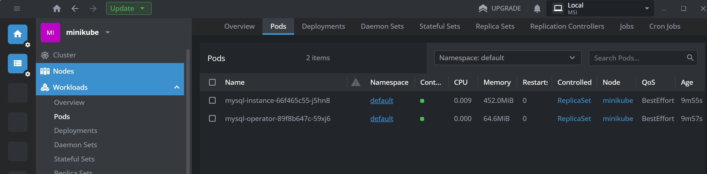

# Репозиторий для выполнения домашних заданий курса "Инфраструктурная платформа на основе Kubernetes-2024-10" 


#### Применим манифесты
```bash
kubectl apply -f ./
```

#### Проверяем что все ресурсы созданы и в частности pod MySQL и persistent volume для него
Консоль - ресурсы созданы:

Lens - deployment:

Lens - pods:

Lens - persistent volume:

Lens - persistent volume claim:

Lens - custom resource definition:

Lens - custom resource:

Lens - service account:

Lens - cluster role:

Lens - cluster role binding:

Lens - replica sets:

Lens - service:

Lens - endpoint:
