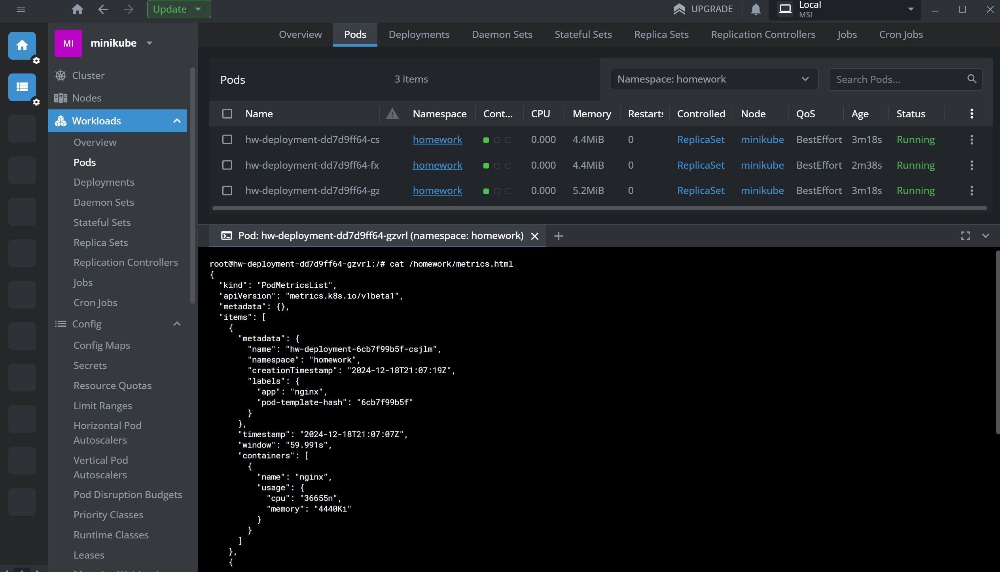
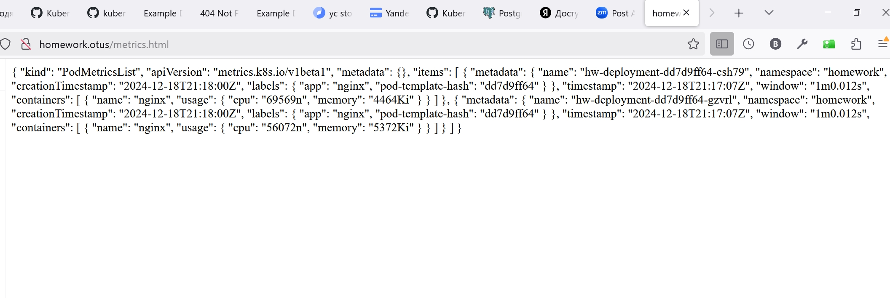
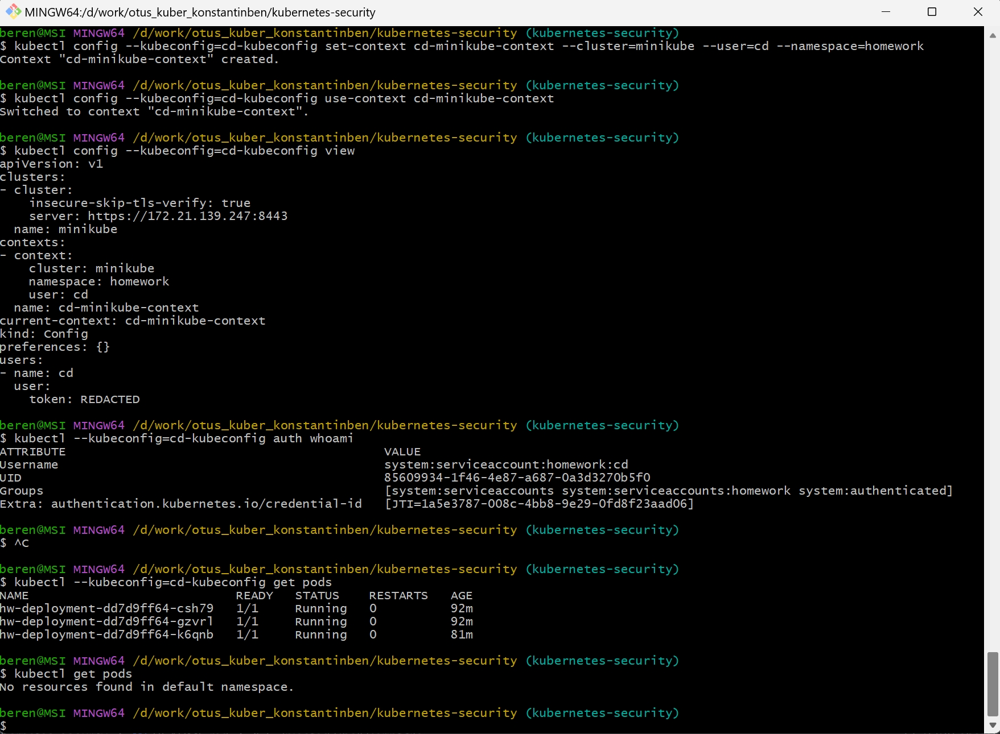

# Репозиторий для выполнения домашних заданий курса "Инфраструктурная платформа на основе Kubernetes-2024-10" 

#### Установим ingress controller и metrics-server:
```bash
minikube addons enable ingress
minikube addons enable metrics-server
```

#### Применим манифесты
```bash
kubectl label nodes minikube homework=true
kubectl apply -f ./namespace.yaml -f ./sa.yaml -f ./role.yaml -f ./role-binding.yaml
kubectl apply -f ./secret.yaml
kubectl apply -f ./storageClass.yaml -f ./pvc.yaml
kubectl apply -f ./
```

#### Проверяем видимость метрик



#### Создадим для сервис аккаунта cd токен со сроком действия 1 день и сохраним его в файл token
```bash
kubectl create token cd --namespace homework --duration=24h > token
```

#### Создадим для сервис аккайнта cd kubeconfig в файле cd-kubeconfig
Для этого добавим в cd-kubeconfig последовательно токен, кластер и контекст
- токен из файла token
- клaстер minikube с текущим IP и выключенной верификацией по tls
- контекст для кластера minikube и сервис аккаунта cd
```bash
kubectl create token cd --namespace homework --duration=24h > token
kubectl config --kubeconfig=cd-kubeconfig set-credentials cd --token=$(cat ${TOKEN})
kubectl config --kubeconfig=cd-kubeconfig set-cluster minikube --server=https://$(minikube ip):8443  --insecure-skip-tls-verify
kubectl config --kubeconfig=cd-kubeconfig set-context cd-minikube-context --cluster=minikube --user=cd --namespace=homework
```

#### Просмотр созданного kubeconfig
```bash
kubectl config --kubeconfig=cd-kubeconfig view
```

#### Применяем созданный kubeconfig
```bash
kubectl config --kubeconfig=cd-kubeconfig use-context cd-minikube-context
```

#### Проверяем, что конфиг применился
```bash
kubectl config --kubeconfig=cd-kubeconfig view
kubectl --kubeconfig=cd-kubeconfig auth whoami
# отдает поды, поскольку в cd-kubeconfig прописан namespace
kubectl --kubeconfig=cd-kubeconfig get pods
# не отдает поды. поскольку в нейспейсе default ничего нет
kubectl get pods
```
