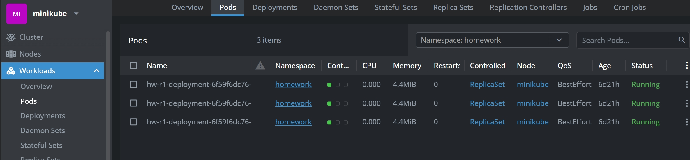
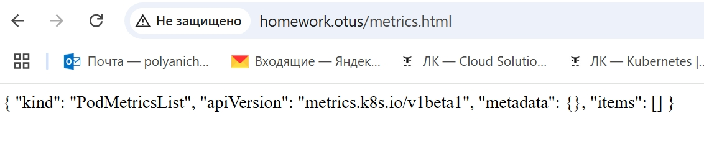
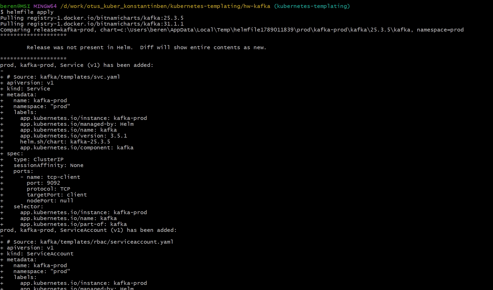
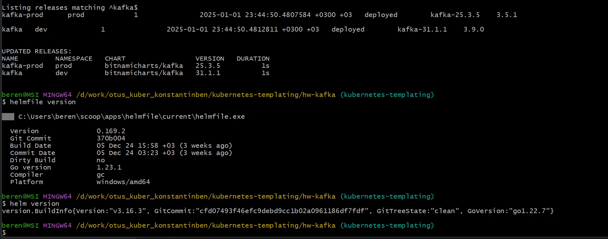

# Репозиторий для выполнения домашних заданий курса "Инфраструктурная платформа на основе Kubernetes-2024-10"

#### Установим ingress controller и metrics-server:
```bash
minikube addons enable ingress
minikube addons enable metrics-server
```

#### Установили helm и helmfile:
```bash
helm version
```
```
version.BuildInfo{Version:"v3.16.3", GitCommit:"cfd07493f46efc9debd9cc1b02a0961186df7fdf", GitTreeState:"clean", GoVersion:"go1.22.7"}
```

```bash
helmfile version
```
```
C:\Users\beren\scoop\apps\helmfile\current\helmfile.exe

  Version              0.169.2
  Git Commit           370b004
  Build Date           05 Dec 24 15:58 +03 (3 weeks ago)
  Commit Date          05 Dec 24 03:23 +03 (3 weeks ago)
  Dirty Build          no
  Go version           1.23.1
  Compiler             gc
  Platform             windows/amd64
```

#### Установили label для ноды minikube
```bash
kubectl label nodes minikube homework=true
```

#### Перейдем в директорию hw-chart и применим helm templates
```bash
helm upgrade r1 ./ --install
```

```
coalesce.go:286: warning: cannot overwrite table with non table for redis.metrics.image (map[digest: pullPolicy:IfNotPresent pullSecrets:[] registry:docker.io repository:bitnami/redis-exporter tag:1.67.0-debian-12-r0])
Release "r1" has been upgraded. Happy Helming!
NAME: r1
LAST DEPLOYED: Thu Dec 26 01:55:07 2024
NAMESPACE: default
STATUS: deployed
REVISION: 5
TEST SUITE: None
NOTES:
Адрес приложения: http://homework.otus
```

#### Проверяем работу приложения



#### Перейдем в директорию hw-kafka и применим helmfile
```bash
helmfile apply
```

